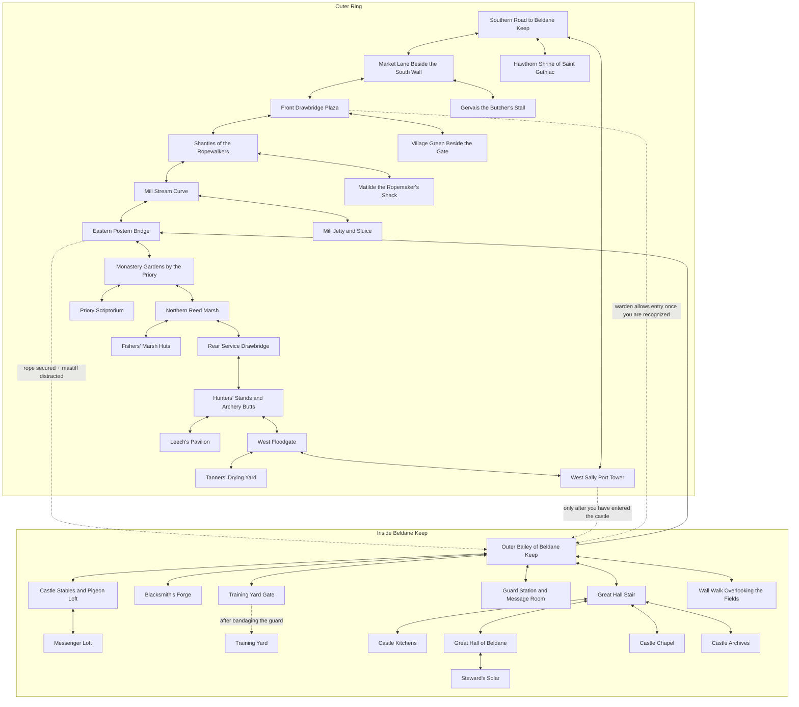

# Castle Ledger Location Map

Notes:

- Solid arrows are ordinary travel links.
- Dashed arrows are conditional access points.
- The main outdoor loop is the 12-node ring at the top.
- The most important breakthrough is usually `east_postern -> outer_bailey`.
